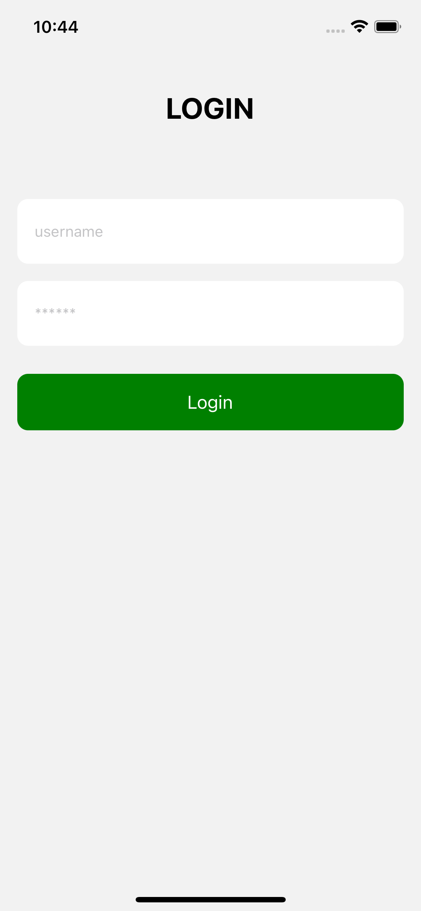
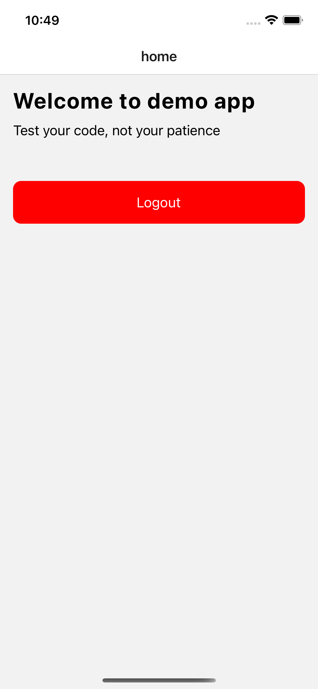
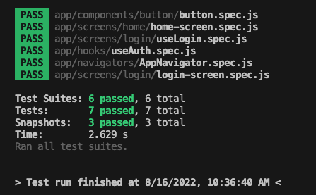

## Jest testing playground project

### What?

A simple demo to show `unit tests`, `component tests` with Jest

### Why not integration test?

Will implement in future

### Credential

* username: tuan
* password: 123456

### Documents

[Jest](https://jestjs.io/docs/getting-started)
[TDD](https://learntdd.in/react-native/)
[React native testing](https://reactnativetesting.io/unit/intro)
[Callstack blog](https://callstack.github.io/react-native-testing-library/docs/react-navigation/)
[hooks testing](https://react-hooks-testing-library.com/usage/basic-hooks#rendering)
[testing library](https://github.com/testing-library)

### Preview

LoginScreen

HomeScreen

Test result

